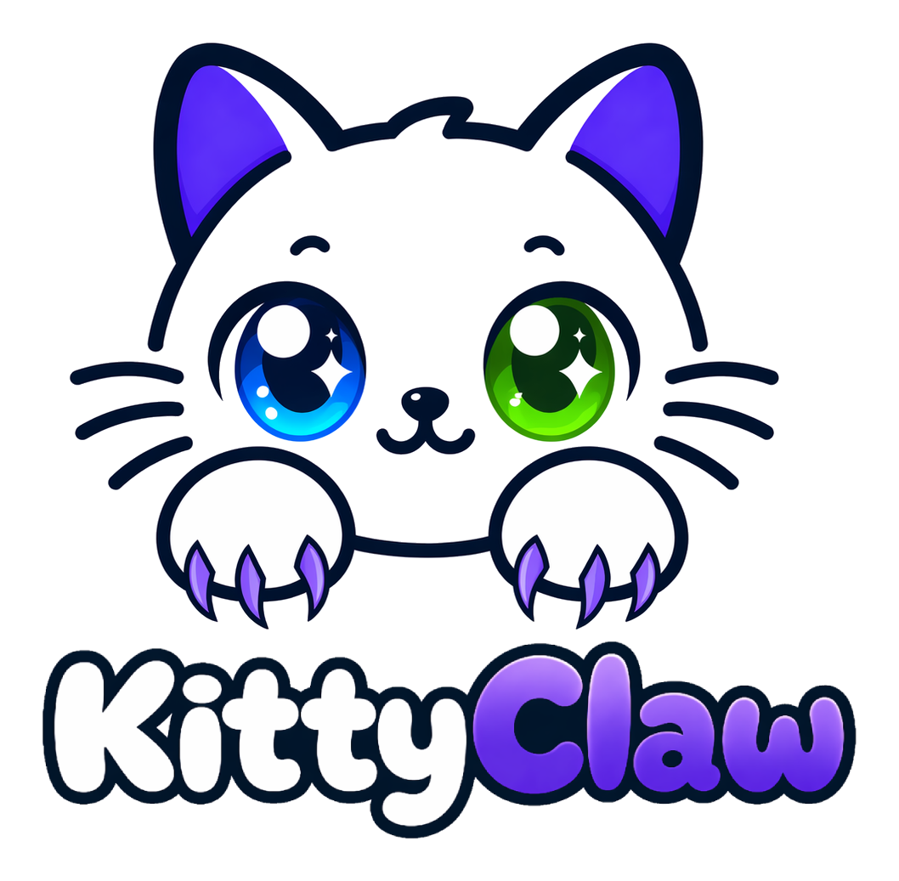

<p align="center">
  
</p>

# KittyClaw

<p align="center">
  <video src="https://github.com/user-attachments/assets/7c3085af-e98e-4424-9962-247467d9cc4d" controls muted loop></video>
</p>

<p align="center">
  <a href="https://kittyclaw.dev">kittyclaw.dev</a> · <a href="https://kittyclaw.dev/#waitlist">Get early access</a>
</p>

A kanban board that **orchestrates agentic projects**. Each column is a workflow stage (`Backlog`, `Todo`, `InProgress`, `Review`, `Done`, `Blocked`). Each project has members that can be human owners or **LLM agents** (programmer, groomer, producer, qa-tester, committer, code-janitor, evaluator, documentalist). A background `AutomationEngine` dispatches these agents based on triggers (column changes, comments, intervals, git commits, …), running them as `claude` CLI subprocesses whose output streams into an in-app drawer.

## Tech Stack

- **.NET 10** / **Blazor Server** (interactive SSR)
- **SQLite** via Entity Framework Core (one DB per project)
- **OpenAPI** with auto-generated Markdown docs
- External: **[Claude Code CLI](https://docs.claude.com/en/docs/claude-code/overview)** + **[Git](https://git-scm.com/downloads)** (required on PATH for agent dispatch and auto-commits)

## Getting Started

### Prerequisites

- [.NET 10 SDK](https://dotnet.microsoft.com/download)
- [Claude Code CLI](https://docs.claude.com/en/docs/claude-code/overview) — `claude` on your PATH
- [Git](https://git-scm.com/downloads) — `git` on your PATH

On first launch an onboarding popup detects whether `claude` and `git` are available. You can continue without them, but agent runs and auto-commits will fail until they are installed and on the PATH.

### Run

From the repo root:

```
run.bat        (Windows)
./run.sh       (macOS / Linux)
```

Both wrap `dotnet watch --project KittyClaw.Web --non-interactive` and serve the app at **http://localhost:5230** with hot reload enabled.

### Creating a project

From the home page, type a name and click **Create**. A popup asks you to set a workspace folder (absolute path to a repo/folder) and offers to create it if missing. Click **Initialize** to:

1. Create the project registry entry + per-project SQLite DB.
2. Copy the project template from `ProjectTemplate/` (`preamble.md`, `{agent}/SKILL.md`, empty `memory.md`, `automations.json`, `CLAUDE.md`) into the workspace — agent files under `<workspace>/.agents/`, `CLAUDE.md` at the workspace root.
3. Run `git init` if the workspace is not already a git repo (skipped if `git` isn't installed).
4. Create a member for each agent slug found in the template.
5. Navigate to the board.

The workspace folder itself is never deleted by KittyClaw, even when you delete a project.

### Data Storage

All KittyClaw data is stored locally in `%APPDATA%/KittyClaw/`:

- `registry.db` — project registry
- `projects/{slug}.db` — per-project database (tickets, comments, labels, columns, members)
- `uploads/` — uploaded images
- `runs/{runId}.json` — agent run snapshots (events, status, exit code)
- `settings.json` — language + onboarding flag

Per-project agent state lives **in the workspace**: `<workspace>/.agents/{agent}/memory.md`, `<workspace>/.agents/channel/` (session state), etc.

## Project Structure

| Path | Description |
|---|---|
| **KittyClaw.Core** | Domain models, EF Core contexts, services, automation engine, embedded project template |
| **KittyClaw.Core.Tests** | xUnit tests (conditions, triggers, signals, JSON polymorphism) |
| **KittyClaw.Web** | Blazor Server UI + REST API |
| **KittyClaw.QaRunner** | Isolated test-instance launcher (Playwright + scenario runner) used by the qa-tester agent |
| **KittyClaw.ClaudeMock** | Mock `claude` CLI used by `KittyClaw.QaRunner` for hermetic agent dispatch in tests |
| **ProjectTemplate/** | Source of truth for new-project initialization. Files under `Agents/` are written to `<workspace>/.agents/`; `CLAUDE.md` is written to the workspace root. |
| **tools/** | Repo helpers (e.g. `publish-stable.ps1` to bundle Web + QaRunner + ClaudeMock for a stable channel) |

## Architecture

Per-feature architecture documentation lives under [`doc/`](doc/index.md). Start at `doc/index.md` for an indexed map of the automation engine, agent dispatch, project template, REST API, storage, and Kanban UI.

## API

All endpoints are under `/api`. The documentation is auto-generated from the live OpenAPI spec:

- Human-readable Markdown: `GET http://localhost:5230/api/docs`
- Machine-readable JSON: `GET http://localhost:5230/openapi/v1.json`

## For AI Agents

This app is designed to be operated by AI agents through its REST API. Here's how to get started:

1. **Read the live API docs** at `http://localhost:5230/api/docs` — every endpoint, request/response example, and schema, always up to date with the running server.
2. **Identify yourself** — `author` is **required** on every mutating endpoint; omitting it returns HTTP 400. Use your plain agent name (e.g. `"programmer"`, `"groomer"`). The human user is `"owner"`.
3. **Discover the board** — call `GET /api/projects` first, then `GET /api/projects/{slug}/columns` to learn the workflow stages and `GET /api/projects/{slug}/members` for assignable members.
4. **Use the right status** — ticket statuses must match existing column names. Fetch columns before moving tickets.
5. **Track your work** — add comments on tickets to explain what you did or what you need. Use `@mentions` to notify members, `#id` to reference tickets in the same project, and `#{slug}:{id}` to reference tickets in another project.
6. **Labels & priority** — use `GET /api/projects/{slug}/labels` to discover available labels, and set priority to `Idea`, `NiceToHave`, `Required`, or `Critical`.
7. **Check mentions** — call `GET /api/projects/{slug}/mentions/{your-handle}` to find tickets that mention you.
8. **Sub-tickets** — set `parentId` when creating a ticket to make it a child. Use `PUT /api/projects/{slug}/tickets/{id}/parent` to reparent, or `DELETE` it to detach. List sub-tickets with `?parentId={id}`.

## Conventions

- **Author format**: `"owner"` for the human user, plain agent name (e.g. `"programmer"`) for AI agents
- **Priority levels**: `Idea`, `NiceToHave`, `Required`, `Critical`
- **Default column**: `Backlog`

## UI Features

- Onboarding popup on first launch with Claude Code + Git detection
- Project creation popup with workspace selection + one-click agent template initialization
- Kanban board with drag-and-drop
- Customizable dashboard view with free-drag tiles backed by `.dashboard/` Markdown files
- Ticket detail panel with comments and activity timeline
- Live agent run drawer (SSE stream of Claude Code output, steer + stop controls)
- New-instruction chat drawer to send an ad-hoc prompt to an agent
- Automations page: list, enable/disable, edit (triggers / conditions / actions), reload from disk, re-initialize agent template
- Markdown rendering with `@mention`, `#id`, and `#{slug}:{id}` cross-project ticket reference support
- Advanced search syntax: `#42`, `@owner`, `>date`, `priority:critical`, `label:bug`, `by:owner`
- Sub-tickets with parent/child relationships and progress tracking
- Column management (create, reorder, customize colors)
- Label and member management
- Image upload in descriptions and comments

## Automation model

- **Triggers**: `interval`, `ticketInColumn`, `statusChange`, `subTicketStatus`, `ticketCommentAdded`, `gitCommit`, `boardIdle`, `agentInactivity`.
- **Conditions**: `ticketInColumn`, `ticketCountInColumn`, `fieldLength`, `priority`, `labels`, `assignedTo`, `hasParent`, `allSubTicketsInStatus`, `ticketAge`.
- **Actions**: `runAgent`, `moveTicketStatus`, `setLabels`, `assignTicket`, `addComment`, `consolidateAgentMemory`, `commitAgentMemory`, `executePowerShell`.
- `{assignee}` placeholder in `runAgent.agent` / `runAgent.concurrencyGroup` resolves from the firing ticket's `assignedTo`.
- Canonical post-run chain: `runAgent` → `consolidateAgentMemory` (focused claude pass that compacts the agent's `memory.md`) → `commitAgentMemory` (commits the result).

---

## More Projects & Contact

→ **Site + demo:** [kittyclaw.dev](https://kittyclaw.dev)

Check out my other projects at **[ekioo.com](https://ekioo.com)**.

Follow me on X: **[@DamienHOFFSCHIR](https://x.com/DamienHOFFSCHIR)**
